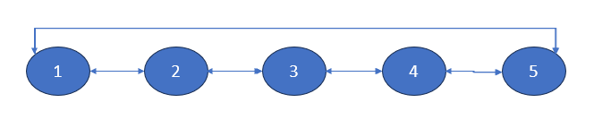
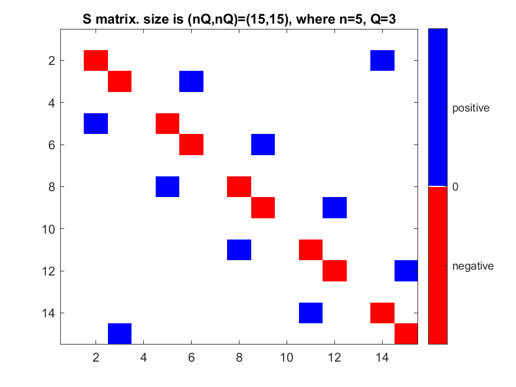
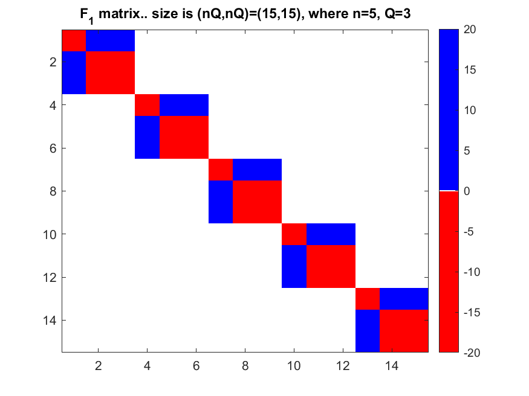
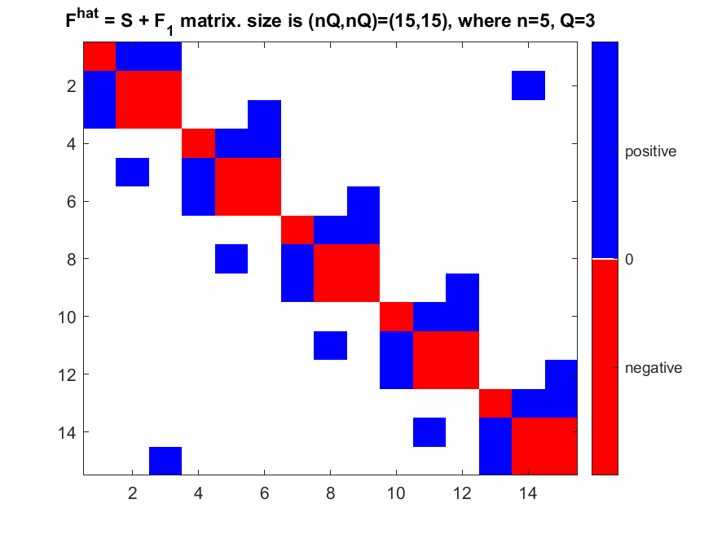
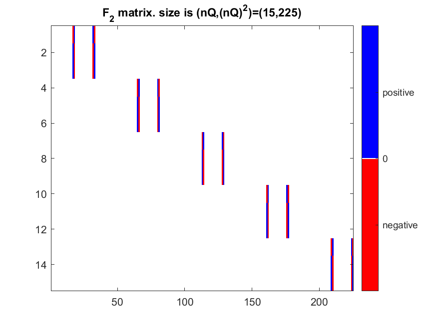
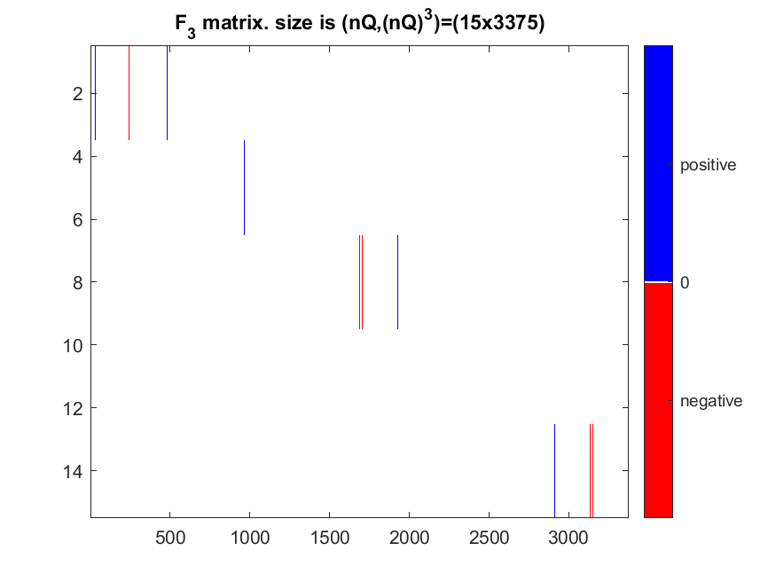
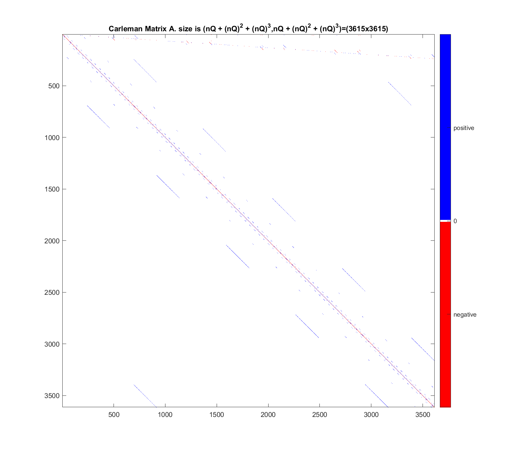
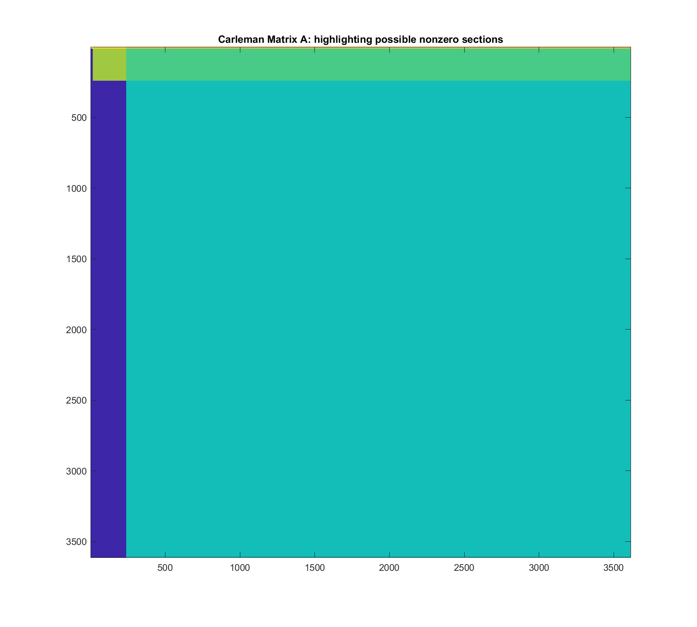

# lbm-carleman-linearization-example
MATLAB script to explore an example Lattice Boltzmann Method (LBM) Carleman Linearization example.

We consider the Lattice Boltzmann Method (LBM) formulation for fluid flow in a simple 1-dimensional graph.  We then investigate the matrices produced by from the Carleman Linearization procedure.

The 1D graph is:

There are 5 nodes, so $n=5$.  The topology wraps around.

There are 3 lattice velocity vectors at each node, so $Q=3$.  The velocity vectors are $\{0,+1,-1\}$.

nQ = 15

(nQ)^2 = 225

(nQ)^3 = 3375

size_S =

    15    15

rank_S =

     8

size_F_1 =

    15    15

rank_F_1 =

     5

rank_F_hat =

    13

size_F_2 =

    15   225

size_F_3 =

          15        3375

nQ + (nQ)^2 + (nQ)^3 = 3615

size_A =

        3615        3615

A_max_value =

    2.6667

A_min_value =

   -4.3333

A_abs_max_value =

    4.3333

S_eigenvalues =

  -1.8090 + 0.5878i
  -1.8090 - 0.5878i
  -0.6910 + 0.9511i
  -0.6910 - 0.9511i
   0.0000 + 0.0000i
  -1.8090 + 0.5878i
  -1.8090 - 0.5878i
  -0.6910 + 0.9511i
  -0.6910 - 0.9511i
   0.0000 + 0.0000i
   0.0000 + 0.0000i
   0.0000 + 0.0000i
   0.0000 + 0.0000i
   0.0000 + 0.0000i
   0.0000 + 0.0000i

F_1_eigenvalues =

   -0.0000
   -1.3333
   -0.0000
   -0.0000
   -1.3333
   -0.0000
   -0.0000
   -1.3333
   -0.0000
   -0.0000
   -1.3333
   -0.0000
   -0.0000
   -1.3333
   -0.0000

F_hat_eigenvalues =

  -2.3285 + 0.2034i
  -2.3285 - 0.2034i
  -1.3333 + 0.0000i
  -2.3285 + 0.2034i
  -2.3285 - 0.2034i
  -1.1871 + 0.6255i
  -1.1871 - 0.6255i
  -1.1871 + 0.6255i
  -1.1871 - 0.6255i
   0.0000 + 0.0000i
  -0.0000 + 0.0000i
  -0.2943 + 0.0000i
  -0.2943 + 0.0000i
  -0.3411 + 0.0000i
  -0.3411 + 0.0000i

The eigenvalues of A may be calculated, but we don't print them all to the console.  The real parts of the eigenvalues are nonpositive.

The eigenvalues of A + conj(transpose(A)) are all real and range from about -19 to about +7.81.

